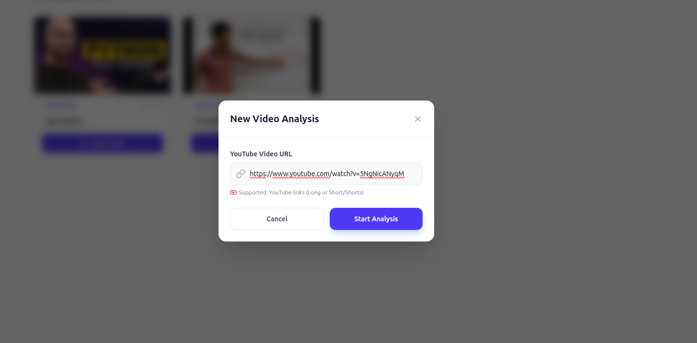
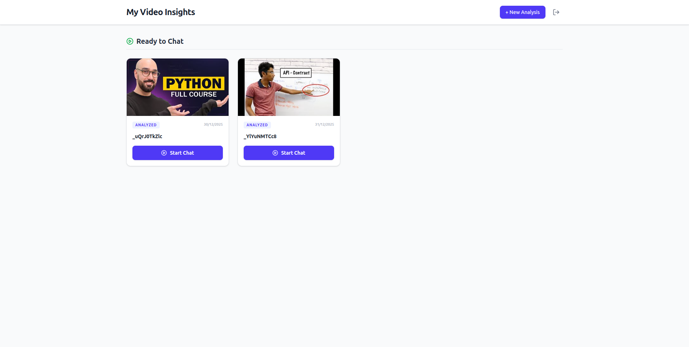
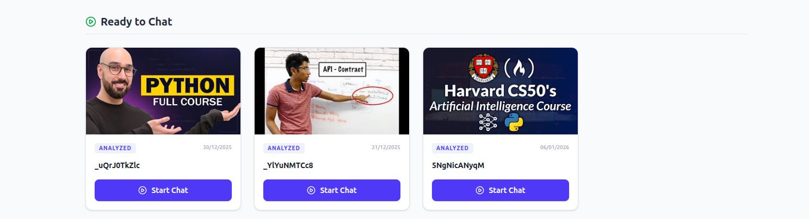

# 🎥 YouTube RAG AI Assistant

A powerful Retrieval-Augmented Generation (RAG) application that allows users to "chat" with YouTube videos. By simply pasting a URL, the system transcribes, embeds, and indexes the video content, enabling users to ask questions and receive precise answers with timestamped references.

## 🚀 Key Features

- **Video Ingestion**: Seamlessly processes YouTube videos via URL.
- **Smart Queuing System**: Handles background processing (transcription & embedding) asynchronously.
- **Interactive Chat**: RAG-powered Q&A interface that understands video context.
- **Timestamp Linking**: Answers often include direct links to the relevant part of the video.
- **Dashboard Management**: Track analyzed videos and history.

---

## 📺 Project Demo

See the AI in action. The assistant retrieves context from a Python tutorial to answer specific coding questions.

## [](https://drive.google.com/file/d/1bNmoUpAr-LJelXbJPnyPvIJC6W0hEd5U/view)

## 🛠️ User Workflow

### 1. The Dashboard

View all previously analyzed videos and start a new session.


### 2. Adding a Video

Simply paste the YouTube URL into the input modal to begin analysis.


### 3. Processing Pipeline

The system utilizes a worker queue to handle heavy lifting (transcription and vector embedding) without freezing the UI.

- **Step A: Queued** - Waiting for worker assignment.
  
- **Step B: Processing** - Generating transcripts and embeddings.
  

### 4. Ready to Chat

Once processed, the video appears in the dashboard, ready for interaction.


---

## 🏗️ Architecture (Conceptual)

- **Frontend**: React + Typescript and tailwind for a responsive UI.
- **Backend**: Python (FastAPI)
- **AI/ML**:
  - LLM for reasoning (llama-3.3-70b-versatile).
  - Vector Database for storing dense and sparse embeddings (Qdrant).
- **Task Queue**: Redis and Celery for handling video processing jobs.

## 📦 Installation

1.  **Clone the repository**

    ```bash
    git clone [https://github.com/RahulGIT24/youtube-rag]
    cd youtube-rag
    ```

2.  **Install Dependencies**

    ```bash
    # For Server:-
    cd server
    uv sync
    source .venv/bin/activate

    # For Client:-
    cd client
    pnpm install
    ```

3.  **Environment Variables**
    For Server and Client :-
    Create a `.env` file and add your keys, take reference from `.env.sample`

4.  **Run Migrations**

    ```bash
    cd server
    alembic upgrade head
    ```

5.  **Run the App**

    ```bash
    # Command to start backend
    cd server
    uv run main.py

    # Command to start frontend
    cd client
    pnpm run dev
    ```

6.  **Run the workers**

    ```bash
    cd server

    # For Celery Worker
    celery -A celery_tasks worker --beat --loglevel=info

    # For Transcription Worker
    uv run transcribe_worker.py

    # For Email Worker
    uv run email_worker.py
    ```

## 🐋 Docker Setup
1. **Ensure Docker and Docker Compose are installed on your machine.**

2. ** Setup Environment Variables**

   Create a `.env` file in the server and client directory and add your configuration, referencing `.env.sample`.

3.  **Build and Run with Docker Compose**

    ```bash
    docker-compose up --build
    ```

## 🤝 Contributing

Pull requests are welcome. For major changes, please open an issue first to discuss what you would like to change.
